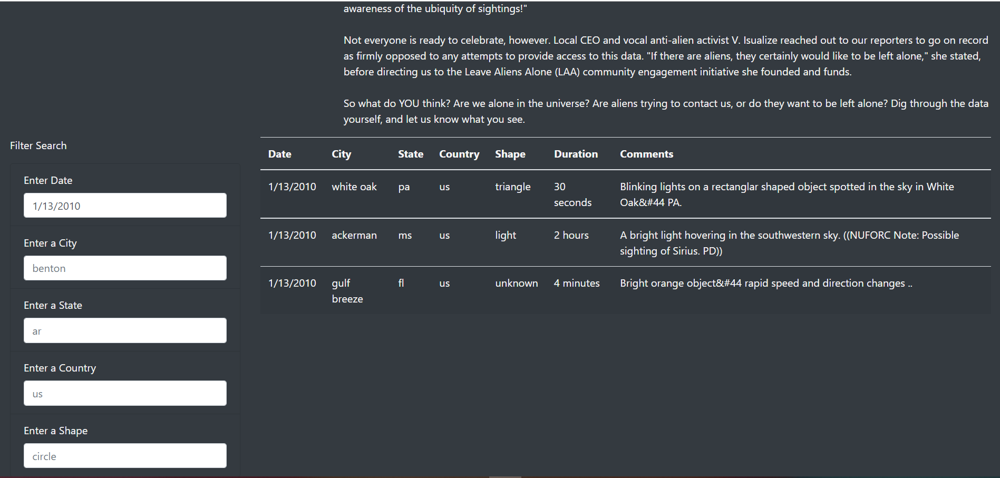
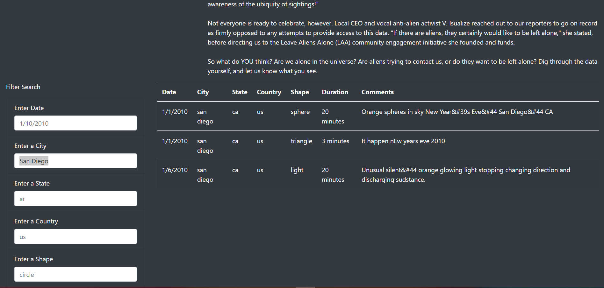
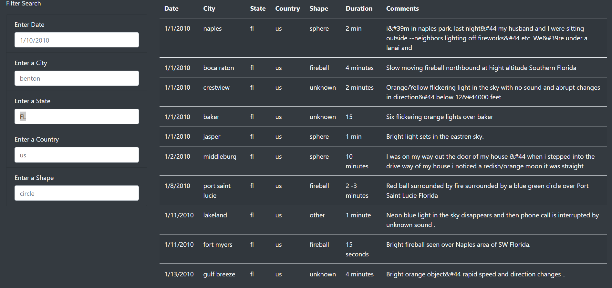
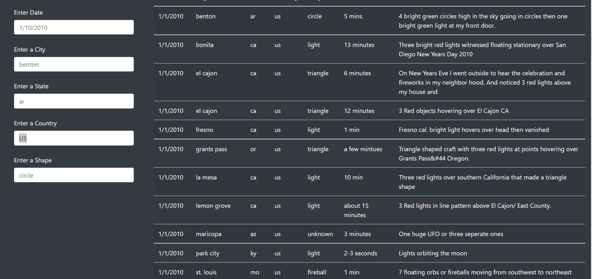
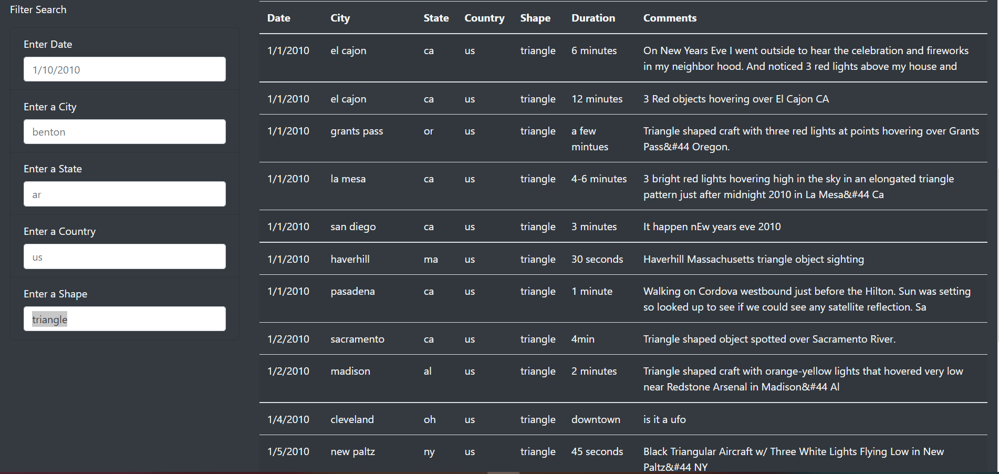
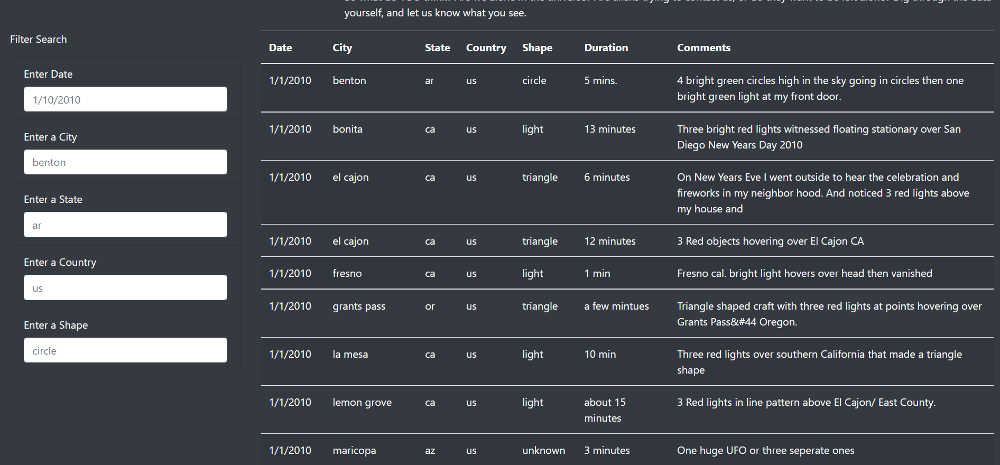

# UFOs
Building a dynamic webpage for UFOs data displayed in a table using the front end development language, JavaScript.

## Purpose and Overview of the project
In this project we have build a table with the UFOs data which lets users refine their search on more than one criteria.We have used bootstrap and CSS to build and style the
entire page. The page also displays a brief article and its summary. We have build the webpage by inserting JavaScript into an HTML page. All the UFO sighting information is 
stored in a JavaScript file like the country , city , state and UFO description. Using this data we have written our code in JavaScript and also used D3 library that produces
sophisticated and highly dynamic graphics in an HTML webpage.

## Results
1. In our JavaScript code we have used the event listener method to add interactive functionality to our webpage. Whenever the user enters a search criteria , the event in 
   our code will listen to each change in the filter and call the update function to update the filters and filter the original table data based on the user input.
   
2. The user can do multiple search based on a particular criteria like the date , city, state, country and the shape of the UFO. The user can give all the filters or select any 
	of them depending on their requirement.
	
3. In our HTML code we have created five list tags under the unordered list tag , one for each filter criteria. The list tag includes the label and the user input with type text 
   and the placeholder displaying the format in which the user will give the input.Below are the five search filters a user can give to filter the table.

4. The first filter is the date filter with label as "Enter Date". The user can enter any date here in the format "1/10/2010" to get the UFO description seen on that particular date.
   As we can see in the image below, we have filtered the table for the date "1/13/2010" .

	

5. The second filter is for the city with label as "Enter City". The user can enter a city name here in lower or uppercase to get the UFO description as seen in a particular city.
 	As we can see from the image below , we have filtered the table based on city "San Diego". Also we have handled the case sensitivity in our code. So even if user give the name 
   of the city in uppercase,it will be converted to lower and will filter the table.

   
   
6. The third filter is for the state with label as "Enter State". The user can enter a state name here in lower or uppercase to get the UFO description as seen in a particular state.
   As we can see from the image below , we have filtered the table based on state "Fl"(Florida). Also we have handled the case sensitivity in our code. So even if user give the name 
   of the state in uppercase,it will be converted to lower and will filter the table.
   
   
   
7. The fourth filter is for the country with label "Enter Country". The user can enter a country name in upper or lower case to get the UFO description as seen in a particular country.
   As we can see from the image below , we have filtered the table based on a country "US". Under this all the states and cities located in US will be displayed, if we give only the
   country filter. 
   
   
   
8. The fifth filter is for the shape of the UFO.The user can filter the table based on the shape of UFO like circle,triangle etc. This filter is under the label "Enter Shape".
   Here also the case sensitivity is handled and the user can provide just the shape filter and all the rows with that particular UFO shape will be displayed. In the image below
   we have filtered the table with shape "triangle".
   
   
   
9. If we refresh the page then all the current filters will be removed and the original table will all the rows will be displayed to the user as shown in the image below.

	
	
10. The user can give one of the five filters as discussed above or can give all the filters together to get a more specific search. The data will be more refined and to the point.

## Summary
1. The drawback of the webpage is that there is no auto fill option for the user in the filter search. For example when the user is entering a search filter for the UFO shape,
   he will not know what are the different shapes if the table data is huge. It will not be possible for the user to go through all the data but with auto fill option the user
   can get the different options for a particular field based on which he can filter the data.
   
2. There can be a dropdown menu list for each search criteria to filter the data in the table. The drop down list will show all the options for that particular field , which the
   user can give to refine the search.
   
3. The webpage can be made more dynamic by adding different categories in the navigation bar, which will redirect to a different page for each detail like the articles,
   information table, images and so on.
   
   

